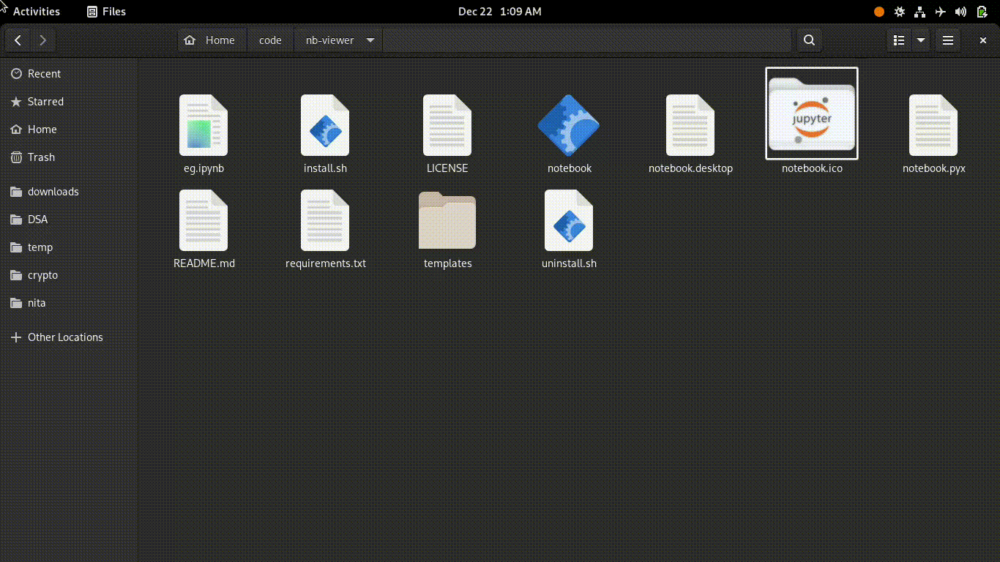
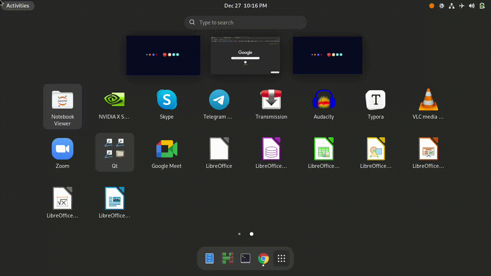

## Jupyter Notebook Viewer
* This is a utility which lets you preview Jupyter notebooks faster on your Linux machine, with a double click.
* Requires no internet and is faster.

## Installation
* Users on ArchLinux can install using:
```fish
yay -S nbviewer-gui
```
* Others can use `pip install nbviewer-gui` to install the package, and you can call the command line utility from the terminal by

```fish
nbviewer-gui notebook.ipynb
```
You need to copy the `notebook.desktop` under the `nbviewergui` directory to `~/.local/share/icons/`, so that you can launch the script by double clicking the *.ipynb file.


